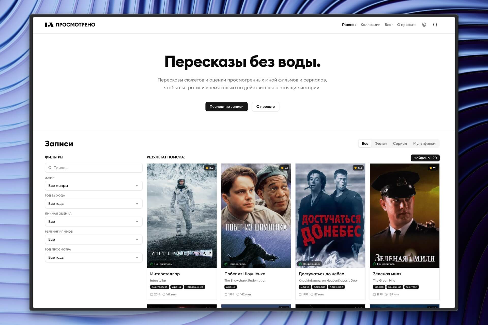

# ПРОСМОТРЕНО — Пересказы без воды.

**ПРОСМОТРЕНО** — это современное полнофункциональное веб-приложение для ведения личного трекера просмотренных фильмов, сериалов, создания тематических подборок (коллекций) и публикации статей в блоге. Проект разработан с использованием передового стека технологий, обеспечивающего высокую скорость работы, приятный пользовательский интерфейс и удобную систему управления контентом (CMS).

## 📸 Превью сайта




## 🛠 Технологический стек

Проект построен на базе современных инструментов и фреймворков:

- **Frontend:** [Next.js 15](https://nextjs.org/) (App Router), React 19, TypeScript
- **Стилизация и UI:** [Tailwind CSS v4](https://tailwindcss.com/) для стилизации, [Radix UI](https://www.radix-ui.com/) для доступных headless-компонентов, [Framer Motion](https://www.framer.com/motion/) для плавных анимаций
- **Backend / CMS:** [Payload CMS 3.0](https://payloadcms.com/) — мощная headless CMS, интегрированная прямо в Next.js
- **База данных:** PostgreSQL (хостинг через [Supabase](https://supabase.com/)), адаптер `@payloadcms/db-postgres`
- **Хранилище медиа:** S3 Object Storage (адаптер `@payloadcms/storage-s3`) для надежного хранения загружаемых изображений
- **Редактор контента:** Lexical Rich Text Editor для написания постов и оформления страниц
- **Формы и валидация:** `react-hook-form` вместе с `zod`

## ✨ Основной функционал

- **Каталог просмотренного:** Сохранение, редактирование и управление фильмами и сериалами (`MediaContents`).
- **Блог и страницы:** Полноценная система публикации записей блога и управления статичными страницами сайта (`Posts`, `Pages`).
- **Создание подборок:** Группировка фильмов или постов в тематические коллекции (`Collections`).
- **Глобальный поиск:** Удобное модальное окно интеллектуального поиска по сайту с дебаунсом запросов.
- **Оптимизированный адаптивный дизайн:** Идеальное отображение как на десктопах, так и на мобильных устройствах.
- **Панель администратора:** Защищенная, кастомизируемая встроенная админ-панель Payload CMS для полноценного управления всеми данными.
- **Аутентификация:** Разграничение прав доступа для администраторов и обычных пользователей.

## 🚀 Запуск проекта (Development)

Для локального запуска проекта на вашей машине выполните следующие шаги:

1. **Клонируйте репозиторий:**

   ```bash
   git clone <URL_репозитория>
   cd project
   ```

2. **Настройте переменные окружения:**
   Скопируйте файл с примером переменных и заполните его вашими данными:

   ```bash
   cp .env.example .env
   ```

   _Важно: обязательно укажите корректную строку подключения к базе данных PostgreSQL в `DATABASE_URI` (например, от Supabase) и PAYLOAD_SECRET._

3. **Установите зависимости:**
   В проекте используется `pnpm` в качестве менеджера пакетов:

   ```bash
   pnpm install
   ```

4. **Запустите сервер разработки:**

   ```bash
   pnpm dev
   ```

5. **Откройте приложение:**
   - Клиентская часть портала доступна по адресу: [http://localhost:3000](http://localhost:3000)
   - Панель администратора находится по адресу: [http://localhost:3000/admin](http://localhost:3000/admin) (_Создайте первого пользователя при первом входе_)

## 📦 Сборка для продакшена (Production)

Для подготовки проекта к деплою на боевой сервер выполните сборку:

```bash
pnpm build
```

После завершения успешной сборки, готовое приложение можно запустить командой:

```bash
pnpm start
```

## 📝 Разработка и полезные скрипты

В файле `package.json` настроены алиасы команд для удобства:

- `pnpm generate:types` — генерирует актуальные TypeScript типы на основе коллекций Payload CMS
- `pnpm lint` — проверяет код линтером (ESLint) на наличие ошибок
- `pnpm test` — запускает все тесты (интеграционные скрипты Vitest и E2E через Playwright)
